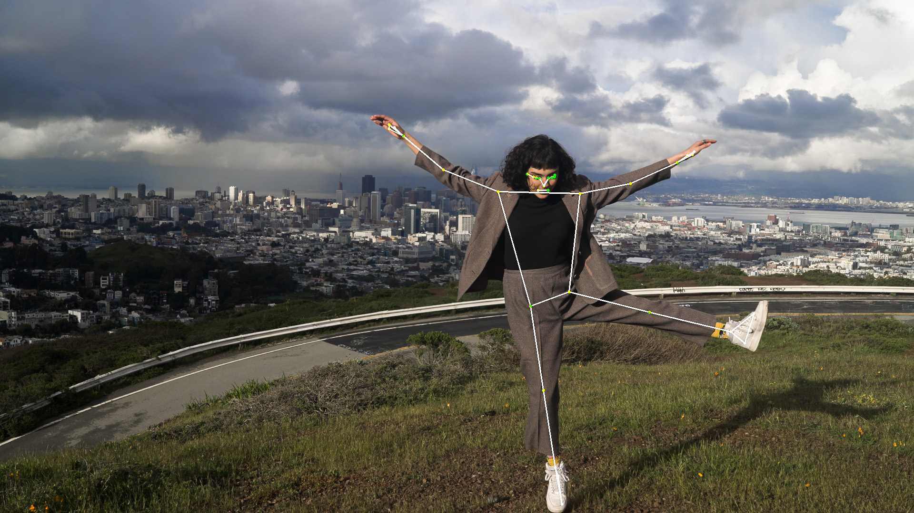

# PoseD – MediaPipe‑powered Pose Detection API



**PoseD** is a tiny FastAPI service that turns Google MediaPipe (and, in the future, other frameworks) into a web‑friendly API. Upload a clip, choose your output flavour, and receive either:

* **Landmarks overlaid** on the original video (MP4)
* **Transparent overlay** only (ProRes 4444 MOV)
* **Both** overlay + per‑frame JSON coordinates in a single multipart response

> 🖥️ A quick demo of the transparent overlay on top of an HDR clip in DaVinci Resolve Studio: [https://youtu.be/PRFPsGsc\_hY](https://youtu.be/PRFPsGsc_hY)

---

## Project layout

```text
poseD/
├── data/               ← sample input & result clips
├── docker/             ← Dockerfile + ignore
├── models/mediapipe/   ← pose_landmarker_heavy.task (mount read‑only)
├── src/posed/
│   ├── app/main.py     ← FastAPI entry‑point
│   └── inference/poseDetect.py
└── docker-compose.yml
```

---

## Quick start (Python environment)

```bash
# 1 clone
git clone https://github.com/suhailphotos/Ayanna.git -b poseD
cd Ayanna

# 2 Conda + Poetry (recommended)
conda env create -f environment.yml      # installs Python 3.11 + deps
conda activate posed
poetry config virtualenvs.create false   # install into conda env
poetry install --no-interaction

# 3 run the API
uvicorn posed.app.main:app --reload --port 8000
```

Open [http://127.0.0.1:8000/docs](http://127.0.0.1:8000/docs) for interactive Swagger UI.

### Example request

```bash
curl -X POST "http://localhost:8000/pose?mode=overlay" \
     -F "file=@data/raw/videos/ana_sdr.mp4" \
     --output ana_sdr_pose_overlay.mp4
```

* `mode=overlay` ⟶ MP4 with skeleton lines
* `mode=transparent` ⟶ ProRes 4444 MOV with alpha
* `mode=both` ⟶ multipart response containing `pose_overlay.mov` **and** `landmarks.json`

---

## Quick start (Docker)

> **Image:** `suhailphotos/posed:latest`

```bash
# pull & run
mkdir -p outputs  # only if you want to mount a writeable dir

docker run --rm -p 8000:8000 \
  --name posed \
  --network everest \
  -v $(pwd)/models:/models:ro \
  suhailphotos/posed:latest
```

Or with the bundled **docker‑compose.yml**:

```bash
docker compose up -d    # builds or pulls & starts the container
```

---

## Features

| Mode                  | What you get                                 | Typical use‑case                                |
| --------------------- | -------------------------------------------- | ----------------------------------------------- |
| **overlay** (default) | Original video + landmarks drawn (MP4/H.264) | Quick visual QA                                 |
| **transparent**       | RGBA overlay only (ProRes 4444 MOV)          | Compositing over HDR / colour‑managed timelines |
| **both**              | Multipart: overlay MOV + `landmarks.json`    | Further ML analysis / motion graphics           |

### Landmarks.json format

```json
[
  [
    [0.3284, 0.3021, 0.0127, 0.99],
  ],
  [
    [0.3290, 0.3017, 0.0128, 0.99],
  ]
]
```

*`[x, y, z, visibility]` for each of the 33 MediaPipe pose points.*

---

## Important source files

* **FastAPI router** – [https://github.com/suhailphotos/Ayanna/blob/poseD/src/posed/app/main.py](https://github.com/suhailphotos/Ayanna/blob/poseD/src/posed/app/main.py)
* **Video‑side inference** – [https://github.com/suhailphotos/Ayanna/blob/poseD/src/posed/inference/poseDetect.py](https://github.com/suhailphotos/Ayanna/blob/poseD/src/posed/inference/poseDetect.py)
* **Container recipe** – [`docker/Dockerfile`](docker/Dockerfile)
* **Runtime orchestration** – [`docker-compose.yml`](docker-compose.yml)

---

## Extending

* Add new models under `models/<framework>/…` and update `POSE_MODEL` env‑var.
* `poseDetect.py` is framework‑agnostic – swap the detector to plug in ONNX or TensorRT.
* Separate **/train** stub included for future fine‑tuning scripts.

Pull requests welcome ✨

