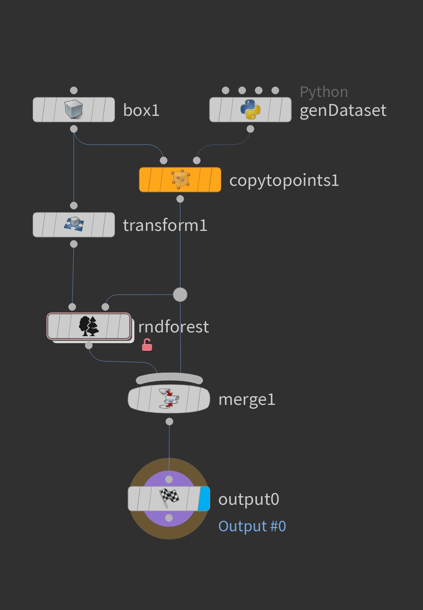
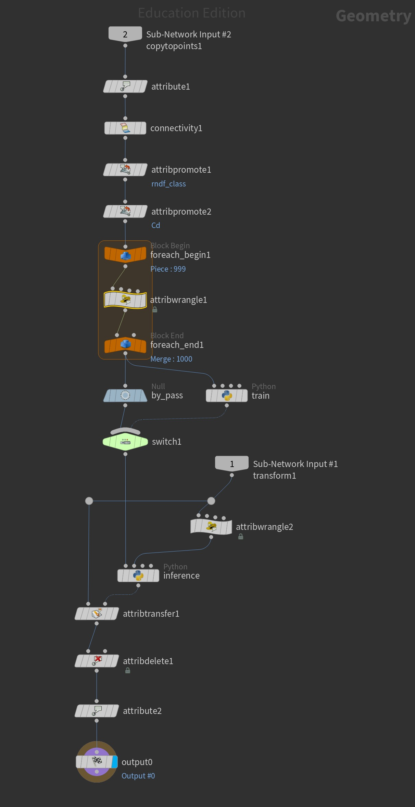

# rndForest: Random Forest ML + Houdini Integration

## Overview

**rndForest** is a modular pipeline and Houdini HDA for interactive machine learning workflows—bridging Python-based Random Forest models with procedural content creation in SideFX Houdini. The entire training and inference process runs remotely, communicating via a FastAPI backend. This approach lets you build ML-driven tools inside Houdini without any direct access to model files or local ML dependencies.

The project demonstrates:

* Clean separation of ML code (Python, scikit-learn) from Houdini client
* Houdini as a UI/geometry client, using API calls to train and predict
* Docker-based server deployment (GPU or CPU)
* Reproducible, scriptable, and easy-to-adapt for your own datasets or workflows

<p align="center">
  
</p>

---

## Features

* **FastAPI Server** for model training/inference
* **Random Forest Classifier** pipeline (scikit-learn)
* **Houdini Digital Asset (HDA):**

  * Press-to-train, on-demand model retraining from geometry
  * Live inference on incoming geometry streams
  * All data exchange via API—no model files on the Houdini client
* **Client Scripts** for standalone usage
* **Dockerized** for fast, portable deployment
* **Example Houdini scenes**

---

## Folder Structure

```
/mnt/ai/projects/rndForest
├── .git
├── .gitignore
├── LICENSE
├── README.md           # ← This file
├── data                # Datasets for training/testing
│   ├── processed
│   └── raw
├── docker
│   └── Dockerfile
├── docker-compose.yml
├── environment.yml     # Conda environment for local dev/testing
├── hda                 # Houdini Digital Assets
│   ├── rndforest.hda
│   └── sop_suhail.rndForest.1.2.hdanc
├── houdini
│   ├── example_scene.hipnc
│   └── rndForest.hipnc
├── images              # Screenshots for documentation/GitHub
│   ├── hda_screencap.jpg
│   └── sop_screencap.jpg
├── models              # Trained models (rf_model.joblib, rf_scaler.joblib)
├── notebooks           # (Optional) Jupyter/Colab experiments
├── poetry.lock
├── pyproject.toml      # Python dependencies (Poetry)
├── scripts             # Client demo scripts
│   ├── client_infer.py
│   └── client_train.py
├── src
│   └── rndforest
│       ├── app         # FastAPI application
│       ├── hda         # Utility tools for HDA
│       ├── inference.py
│       ├── train.py
│       └── vex         # Houdini VEX assets
└── tests
```

---

## Quickstart

### 1. Clone & Build Docker Container

```bash
git clone https://github.com/YOUR_USERNAME/rndForest.git
cd rndForest
docker-compose up --build -d
```

* The API server will run at `http://localhost:8003`
* Default environment variables set dataset and model directories for the container

### 2. Test the API Directly

#### Generate Synthetic Dataset:

```bash
curl -X GET 'http://localhost:8003/generate-dataset?n_samples=500&n_features=3&centers=4' --output data/raw/blobs_test.csv
```

#### Train Model (from dataset):

```bash
curl -X POST 'http://localhost:8003/train?force=true' \
  -F 'file=@data/raw/blobs_test.csv'
```

#### Predict Classes:

```bash
python scripts/client_infer.py
```

### 3. Houdini Usage

#### HDA Installation

1. Place `hda/sop_suhail.rndForest.1.2.hdanc` in your Houdini project.
2. In Houdini, File > Import > Houdini Digital Asset… and load the HDA.

#### HDA Parameters

* **RNDFOREST\_API\_URL**: Set the base URL for your running API (default: `http://localhost:8003`)
* **Train** (Button): Triggers on-demand training. Only retrains if pressed.
* **force\_train** (Optional): Retrain even if a model already exists.

#### Network Example

The HDA expects two inputs:

* **Input 1:** Points/geometry with known class labels (for training)
* **Input 2:** Points to classify (inference)

A typical node graph:

```
 ┌─────────────┐    ┌────────────────────┐    ┌──────────────┐
 │ Training    │    │ rndForest HDA      │    │ Inference    │
 │ Geometry    │───▶│  (Train SOP)       │───▶│ Python SOP   │
 │ (labeled)   │    │  (Inference SOP)   │    │ (result geo) │
 └─────────────┘    └────────────────────┘    └──────────────┘
```

---

## API Endpoints

**Base URL:** `${RNDFOREST_API_URL}` (e.g. `http://localhost:8003`)

### `GET /generate-dataset`

Generate a synthetic dataset for quick experiments.

* `n_samples`: Number of samples (default 500)
* `n_features`: Number of features (default 3)
* `centers`: Number of classes/clusters (default 4)

### `POST /train?force=true|false`

Train a new random forest model from a CSV file.

* **file:** CSV file with columns x1, x2, x3, class
* **force:** If true, retrains regardless of existing model

### `POST /predict`

Predict classes for new points.

* **JSON body:** `{ "points": [[x1, x2, x3], ...] }`
* **Response:** `{ "predictions": [class_idx, ...] }`

---

## How It Works

1. **Training:**

   * Press the Train button in the HDA or use the API. Houdini sends geometry as a CSV to the API for model training.
   * The server saves both the model and its scaler.
2. **Inference:**

   * Houdini gathers query points and posts them to the API `/predict` endpoint.
   * The API returns class predictions for each point, which Houdini assigns as attributes.

**All model logic, state, and file IO remain on the server side.**

---

## Example: Training from Houdini Python SOP

```python
# Triggered from the HDA's Train button
url = f"{hou.getenv('RNDFOREST_API_URL')}/train?force=true"
with open(csv_path, 'rb') as f:
    files = {'file': f}
    r = requests.post(url, files=files)
    print("Training result:", r.json())
```

## Example: Inference from Houdini Python SOP

```python
url = f"{hou.getenv('RNDFOREST_API_URL')}/predict"
response = requests.post(url, json={"points": query_points})
pred_classes = response.json()["predictions"]
```

---

## Development/Testing

* All dependencies listed in `pyproject.toml` (for Poetry) and `environment.yml` (for Conda)
* Development scripts:

  * `scripts/client_train.py`: Example training client
  * `scripts/client_infer.py`: Example inference client
* Unit tests and notebooks: TBA

---

## License

MIT License. See [LICENSE](LICENSE).

---

## Credits

* Project by Suhail | [LinkedIn](https://www.linkedin.com/in/suhailece/)
* For educational and portfolio demonstration purposes.

---

## Screenshots




---

## FAQ

**Q: Does this install any ML dependencies in Houdini?**
A: No. All ML computation, storage, and libraries live in the Dockerized Python server.

**Q: Can I add new models or endpoints?**
A: Yes! Add more FastAPI endpoints or swap in different scikit-learn models as needed.

**Q: How do I point the HDA to a remote server?**
A: Set the `RNDFOREST_API_URL` parameter in the HDA or as a Houdini environment variable.

---

**Want to adapt this for your own ML/Houdini workflow? Fork and go!**

